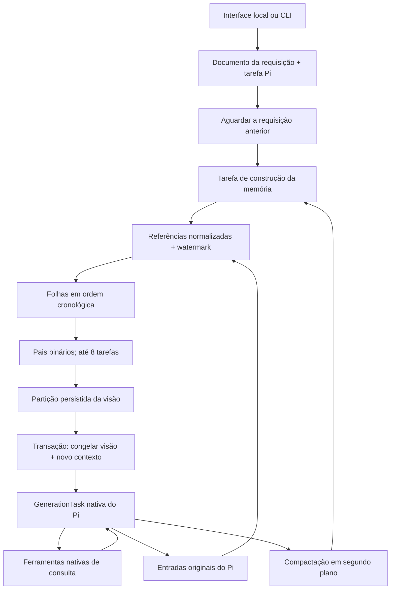

# Arquitetura e limites

As seções até “Adaptador para o terminal Pi” descrevem o SDK/aplicativo independente. O modo nativo do coding-agent, introduzido em 0.4, compartilha o motor de memória, mas mantém o executor de ferramentas no Pi. A análise completa está em [INTEGRATION_REVIEW.md](./INTEGRATION_REVIEW.md).

## Responsabilidades

O aplicativo não implementa um loop concorrente de LLM por fora do Pi. Tanto a conversa principal quanto as tentativas do compactador usam submissões e `GenerationTask` nativas. O cancelamento, o estado parcial, os checkpoints de geração, os resultados das ferramentas, as conversas filhas e a contabilização de uso pertencem ao Pi.

## Código

| Arquivo | Responsabilidade |
| --- | --- |
| `src/app.ts` | Ciclo de vida do aplicativo independente: storage, trava, providers e harness |
| `src/extension.ts` | Factory pública: extensão nativa, políticas e conexão com o harness do hospedeiro |
| `src/controller.ts` | API por conversa: fila, memória, cancelamento e consultas |
| `src/request-task.ts` | Fila, espera, congelamento atômico e submissão idempotente |
| `src/memory/tasks.ts` | Máquina de estados do compactador e conversas filhas |
| `src/memory/store.ts` | Ingestão por watermark, publicação de nós e persistência da partição |
| `src/memory/tree.ts` | Regras puras de intervalos, orçamento e paginação UTF-8 |
| `src/memory/documents.ts` | Documentos e famílias tipadas do Pi |
| `src/memory/transcript.ts` | Projeção de mensagens sem blocos de raciocínio |
| `src/memory/tools.ts` | `zoom`, `date` e busca paginada no texto original |
| `src/models.ts` | Providers nativos, demonstração e limite conservador de contexto |
| `src/writer-lock.ts` | Exclusão entre processos por uma transação SQLite exclusiva |
| `src/server.ts`, `web/` | HTTP em loopback e interface, sem dependências externas de UI |

## Invariantes

1. IDs do Pi são globais e podem ter lacunas. Índices OptChat são contíguos e correspondem a referências `entryId + ordinal`. Watermark e referências avançam na mesma transação.
2. Entradas de visão, prompts de sistema e conversas do compactador não entram no índice principal. Blocos `thinking` também não entram. O armazenamento nativo do Pi continua sendo o registro de origem e pode conter dados de raciocínio fornecidos pelo provider; não prometemos removê-los de seus registros internos.
3. Um nó `[start, start + count)` tem tamanho potência de dois e alinhamento binário. Só é publicado quando completo; um pai usa seus dois filhos, e uma folha só avança o prefixo em ordem.
4. A partição sempre cobre `[0, processed)` sem lacunas. A ordem de consolidação escolhe a maior razão `(total - start) / (4 * count)` entre pares de irmãos com pai pronto.
5. Antes de responder, `processed === count` e o texto renderizado cabe no orçamento. Não basta todos os nós existirem: o tamanho real é validado também.
6. A transação que troca a cabeça do contexto também persiste a visão da requisição e avança seu checkpoint. O próximo passo só pode submeter a entrada; nunca repetir o reset.
7. Cada pedido tem seu ID persistido. Repetir ID + mesmo texto retorna a tarefa existente. Repetir o ID com outro texto é erro.
8. A interface observa o estado; ela não é a fonte da memória. Eventos de progresso podem ser agrupados. A ingestão sempre lê registros persistidos e seu watermark.
9. Fechar o processo preserva tarefas para retomada. Cancelar é uma operação distinta, nativa do Pi. Conversas dos compactadores pertencem às suas tarefas; a construção da memória usa uma tarefa de segundo plano da conversa.

O compactador recebe dois blocos: a visão atual até a mensagem anterior, para folhas, ou até o fim do intervalo, para pais; e a fonte completa a resumir. O contexto conserva a resolução da visão atual, sem os endereços. Se o corte atravessar uma parte, seus filhos são abertos somente nessa projeção temporária, sem dividir a partição persistida. O exemplo de escala tem exatamente 512 bytes e é verificado por teste. O esforço configurado para compactação é `medium`.

## Diferenças deliberadas da especificação de referência

- **Armazenamento nativo.** Em vez de manter dois logs autoritativos paralelos, usamos o log Pi e famílias de documentos para nós e referências. O índice não copia todo o texto original. Dados de entrada ainda na fila permanecem no documento da requisição até a admissão no histórico Pi.
- **Partição salva.** O gist reconstrói a visão durante a carga. Como a disponibilidade de pais depende do momento em que chamadas terminam, reconstruí-la pode produzir outra partição e alterar o prefixo de cache. Aqui a partição e a visão de cada execução são persistidas.
- **Orçamento inclui marcação.** Os 128.000 bytes cobrem `<chat>`, endereços e separadores, além do texto. Isso é um limite de bytes, não uma promessa de quantidade exata de tokens.
- **Compactação entre execuções.** Ela começa em segundo plano ao concluir uma resposta. A próxima mensagem espera essa tarefa terminar. Não há polling que faça chamadas de modelo enquanto o usuário está ausente, nem ping para manter cache.
- **Fila explícita no SDK/app.** Mensagens concorrentes iniciam execuções separadas, em ordem. O SDK e o chat independente não implementam steering ou subagentes de trabalho. O modo nativo do coding-agent preserva o steering e as ferramentas fornecidos pelo hospedeiro; suas conversas filhas duráveis continuam sendo as do compactador.
- **Limites sem esconder perda.** Zoom oferece páginas completas em UTF-8, e a API aponta a próxima página. Não truncamos o histórico para cumprir um limite de ferramenta. A busca inspeciona até 250 registros por página e devolve até 20 ocorrências; `next` permite continuar.
- **Tentativas limitadas.** Cada nó tenta até cinco respostas para tamanho, retendo a menor. Se nenhuma couber, o nó recebe `oversized: true`; a visão ainda deve caber no orçamento. Falhas de execução têm até três tentativas, espaçadas por 10 segundos persistidos, e depois ficam visíveis. Isso evita gastos ou espera sem fim. Uma nova preparação retenta o nó incompleto.
- **Providers e cache nativos.** O protocolo de memória é uma seção nativa de prompt, estável. Instruções e extensões do hospedeiro são preservadas; o aplicativo independente fornece sua própria persona e somente as ferramentas de memória. Um hook puro junta visão e mensagem em dois blocos de texto; a correção não depende dele porque o contexto já está persistido. O hospedeiro deve manter seus próprios prompts estáveis para preservar o prefixo. Usamos `cacheRetention: short` e a tradução do próprio pi-ai. Não injetamos marcações Anthropic em payloads OpenAI, nem prometemos taxa de acerto de cache. O Pi preserva sua identidade de sessão, embora o contexto da conversa seja reiniciado por pedido.
- **Proteção fora de hooks.** Hooks de geração do Pi podem reportar falhas e continuar. Por isso a espera, o orçamento e o congelamento são transações/tarefas; o limite conservador do payload está na fronteira do provider e devolve um erro normalizado antes da chamada externa.

## Limites práticos

O modelo pode deixar fatos importantes fora dos resumos. A preservação do texto original e a busca literal reduzem a perda de recuperabilidade, mas não garantem que o agente sempre procurará o fato certo. Qualidade deve ser medida com um conjunto de conversas representativo, usando o provedor real.

A conversa principal tem limite padrão de entrada de 32.000 bytes e saída de 8.192 tokens. Um laço de ferramentas muito longo pode atingir o limite conservador do provider; nesse caso termina com erro, preservando o histórico, e uma nova mensagem prepara outro contexto. Não há compressão automática nativa competindo com a árvore OptChat: `settings.compaction.enabled` é `false`.

O limite no transporte compara bytes do contexto textual serializado com a janela do catálogo Pi menos reservas. É uma proteção conservadora, não um tokenizer oficial nem um preditor exato de tokens. A API do provedor continua impondo seus limites. Orçamentos incompatíveis com o catálogo instalado são rejeitados na inicialização.

Armazenamento cresce com o uso, inclusive os registros de tarefas e as conversas de compactação. Não foi executado um benchmark de milhões de mensagens. O histórico não é apagado automaticamente; planeje espaço em disco e backups. Use filesystem local: a trava e a semântica de `fsync` não foram qualificadas para NFS ou sincronização concorrente de arquivos.

O servidor escuta somente em `127.0.0.1`, valida Host/Origin e exige um cabeçalho próprio em mutações. Não possui autenticação multiusuário ou suporte a exposição pública. A UI insere texto como texto, sem renderizar HTML de mensagens. Chaves e arquivos de configuração não são rotas HTTP.

## Fontes verificadas

- [Especificação OptChat](https://gist.github.com/VictorTaelin/91837951a5ce5b38f341ec1ba1df6449).
- [README oficial do Pi Durable](https://github.com/earendil-works/pi/blob/v1.1.0/packages/durable/README.md) e [especificação normativa](https://github.com/earendil-works/pi/blob/v1.1.0/packages/durable/docs/spec.md), conferidos contra os tipos e a implementação npm 1.1.0.
- [OpenAI: prompt caching](https://developers.openai.com/api/docs/guides/prompt-caching): reutilização depende de prefixos idênticos e regras do modelo; retenção e marcações variam entre versões.
- [GPT-6 Sol](https://developers.openai.com/api/docs/models/gpt-6-sol) e [GPT-6 Luna](https://developers.openai.com/api/docs/models/gpt-6-luna), para os IDs configuráveis. O aplicativo usa os limites do catálogo da versão Pi instalada, que podem ser mais conservadores que a documentação do provedor.

## Adaptador para o terminal Pi

`pi/index.ts` é a entrada do pacote `pi install`, carregada como TypeScript pelo Pi. `src/pi` conecta os comandos, renderização e consulta de memória ao mesmo `openApp` e controlador do SDK; não contém outra árvore nem fila. As chamadas de modelo passam pelo `modelRegistry` público do hospedeiro e reutilizam sua autenticação a cada requisição.

No modo padrão, mensagens comuns do coding-agent alimentam a memória. `sources.ts` deriva os originais da ancestralidade selecionada e respeita edições de contexto; `archive.ts` faz a cópia durável, reutiliza resumos do prefixo comum em forks e persiste a visão exata; `projection.ts` conserva o sistema efetivo e toda a execução atual; `native.ts` coordena os hooks públicos, falhas e cancelamento. Não há cópia das implementações de ferramentas nem executor paralelo para elas.

Cada sessão tem seu armazenamento; `/tree` mantém ramos isolados e `/fork` cria outro armazenamento. A conversa independente por projeto/canal da versão 0.3 continua disponível através de `/optchat chat`. Abrir ou consultar não retoma chamadas. A [matriz de integração](./INTEGRATION_REVIEW.md) diferencia garantias de memória, execução do host e limitações de recuperação.

## Integração 0.2 e autoria

`createOptChat` aceita somente os modelos como campos obrigatórios; os demais limites têm padrões e validação. `prompt()` é um atalho para `enqueue()` seguido de `wait()`, preservando IDs, fila e recuperação. A tarefa de preparação adiciona a extensão com a API `configure` do Pi, preserva instruções, extensões, diretório e raciocínio do hospedeiro e recusa políticas de ferramentas que excluam `zoom`, `date` ou `search`.

Os compactadores limpam extensões, ferramentas e instruções herdadas do hospedeiro. A migração reconhece apenas o texto exato do prompt padrão 0.1. A documentação de autoria e procedência está em [CREDITS.md](./CREDITS.md), e as referências estruturadas em [CITATION.cff](./CITATION.cff).
