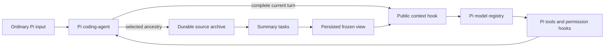

# Architecture

[Documentation index](../README.md) · [Repository map](../development/repository.md) · [Conformance](./conformance.md)

One memory engine is shared by the Pi coding-agent adapter, the standalone application and the SDK. Their **execution ownership differs**. Installing the SDK factory does not intercept arbitrary Pi submissions; installing the coding-agent package adds public host hooks.

## Entry points and ownership

| Layer                                                                           | Owns                                                                                        | Does not own                                                                                |
| ------------------------------------------------------------------------------- | ------------------------------------------------------------------------------------------- | ------------------------------------------------------------------------------------------- |
| Pi coding-agent adapter (`src/pi/`)                                             | Host-source import, selected-branch memory, frozen-view receipts, retrieval tool and status | Coding-agent tools, permission decisions, streaming, steering or replay of external actions |
| SDK factory/controller (`src/extension.ts`, `controller.ts`, `request-task.ts`) | Dedicated conversation's durable input queue, context preparation and request coordination  | Host storage lifecycle, credentials or the safety of custom tool replay policies            |
| Application (`src/app.ts`, `models.ts`, `writer-lock.ts`)                       | Node storage, exclusive writer, supplied providers and harness lifecycle                    | Remote exactly-once delivery                                                                |
| Memory engine (`src/memory/`)                                                   | Source references, summaries, chronological view and retrieval                              | UI, account authentication or another tool executor                                         |
| CLI and web (`src/cli.ts`, `server.ts`, `web/`)                                 | Input, display and observation of committed state                                           | A second authoritative history                                                              |

## Memory representation

A **memory record** is normalized text with a kind and timestamp. One Pi entry can yield several records: assistant text, a tool call, and later its result have separate addresses. Pi entry IDs can contain gaps; OptChat indexes are contiguous. `start+count` addresses are memory intervals, not entry IDs.

| Kind   | Source                                                                   |
| ------ | ------------------------------------------------------------------------ |
| `user` | User content                                                             |
| `talk` | Visible assistant text                                                   |
| `tool` | Tool name and arguments                                                  |
| `echo` | Tool result or included shell output                                     |
| `note` | Imported extension context or branch summary; not attributed to the user |

Thinking blocks are omitted from memory, not necessarily from Pi's own original transcript. Images/non-text content are represented by textual presence markers in summaries; current-turn images and native archived originals remain intact. The retrieval tool returns normalized text, not historical image attachments. No visual understanding is promised.

The SDK indexes committed `pi.user`, `pi.assistant` and `pi.tool-result` entries by `entryId + ordinal`. Source references and the ingestion watermark advance in one transaction. Native mode additionally copies selected host sources into `optchat.source` entries with Pi IDs, source fingerprints and original content without thinking. Its completed-message journal preserves another recovery record before Pi finishes its message-end processing. Generated memory views, system messages and compactor conversations do not enter the main source index.

## Summary tree and bounded view

Every leaf covers one memory record; a parent covers two adjacent, equally sized children. Addresses are aligned powers of two. Nodes are immutable after publication. Leaves are committed in chronological order so their compactor context contains earlier records. The next long leaf and independent ready parents can execute concurrently, up to the configured job limit.

Three node methods are used:

- `verbatim`: the complete normalized original already fits the target.
- `concat`: both child summaries together fit without a model call.
- `model`: a durable task asks the configured compactor for a summary.

The default target is **512 UTF-8 bytes per node**, not 512 tokens or characters. Up to five size attempts retain the shortest nonempty result. An exhausted result can be marked `oversized`; this does not waive the complete view's hard budget. Execution failures have a separate bounded retry policy, by default three failures with 10-second persisted delays.

The view is a persisted partition covering `[0, processed)` with no gaps or overlaps. It appends new leaves and replaces available sibling pairs with completed parents; it never splits an existing persisted part. It grows without merges until exceeding the high-water budget, then merges toward half that budget. Merge priority is `(total - last) / count`, where `last = start + 2 * count - 1` is the sibling pair's final message; ties choose the oldest pair. An unfinished batch retains its target across commits and restarts. The rendered `<chat>` wrapper, addresses and separators all count toward the byte budget. Preparation must finish all records and fit the budget before a new request proceeds.

The compactor has its own persisted partition with one quarter of the main view's high-water budget and half that as its low-water target (16–32 KB by default). It resets from the current main partition after a main-view merge, and otherwise appends completed leaves. If missing parents prevent the preferred size, it may temporarily use up to the main hard budget so those parents can be built. Its prefix, without addresses, precedes the complete target and an ASCII dash ruler sized to `nodeBytes`. Stable blocks contain four lines; the closing tag and target follow the final complete block. Leaf context ends before the leaf; parent context includes its covered interval. A crossing part can be expanded in this temporary prefix projection without changing the persisted view. Compactor children clear host instructions, extensions and tools and use medium thinking. This intentionally prevents cross-role system/tool cache sharing. See [cache behavior and its qualification limits](./cache.md).

## Native Pi lifecycle

A context-free custom entry marks the turn boundary. On its first provider attempt, the adapter waits for the prior ancestry's summaries and saves a frozen-view receipt keyed by that boundary. Later attempts reuse it while preserving the full live suffix, tool call/result IDs and thinking signatures. Historical context edits that invalidate the frozen prefix stop the turn instead of changing its meaning silently.

Memory follows the selected branch. `/tree` forks durable history at immutable source entries and copies only common-prefix references and summaries. `/fork` creates another Pi session and imports its selected ancestry into a new store; summaries are rebuilt there. Session replacement/reload closes the old engine. Native `--no-session` uses `MemoryStorage` and creates no persistent archive.

Successful turn/settlement events schedule summaries. A new ordinary prompt enables the preparation it needs. Merely loading the extension or inspecting memory does not enable scheduling. The adapter cancels Pi's normal compaction and cache-renewal pings while native mode is active, without rewriting user settings.

Pi 1.1.0 reports context-hook exceptions and can continue. The adapter therefore catches its own preparation errors, aborts the host request and returns a stopped projection instead of raw history. It also blocks host tools after an archive error. This requires cooperative provider abort handling; arbitrary later context/payload transformations are outside the contract. Long live tool loops can still overflow the model window and require a new turn or larger model.

## SDK and standalone lifecycle

```mermaid
flowchart LR
  Input[Controller input] --> Queue[Request document and task]
  Queue --> Previous[Wait for previous request]
  Previous --> Build[Complete memory preparation]
  Build --> Freeze[Atomic context reset and frozen view]
  Freeze --> Generate[Pi Durable generation and tools]
  Generate --> Sources[Committed original entries]
  Sources --> Background[Background memory build]
```

`enqueue()` validates text and durably creates a conversation-scoped request ID before execution. The same ID and text reuse the existing task; different text is an error. The queue waits for the preceding request to settle even if it failed. The latest 50 request IDs are retained for status/display; original history and request documents are not automatically deleted.

Preparation adds the native memory extension while preserving host persona, other extensions, working directory and thinking level. An explicit tool policy excluding `zoom`, `date` or `search` fails before main inference. The factory's configured main model is applied. The frozen view, context-head reset and task checkpoint commit atomically; recovery cannot perform that reset again after input admission.

The answer phase submits through Pi Durable with a stable request ID and records the outcome, then schedules memory work. `prompt()` is only `enqueue()` followed by `wait()`. Pi Durable's `waitForTask()` enables scheduling, so `wait()` is not passive inspection. Cancelling an observation does not abort a durable task. Closing retains work; `cancel()` and `cancelMemory()` are explicit abort operations.

The separate `/optchat chat` adapter uses this full request-controller path with host authentication. Its workspace/channel history is distinct from native Pi session memory.

## Retrieval and persistence

`zoom(start, count)` returns two children, or full normalized original text for `count=1`. Originals are paged by UTF-8 byte offsets without splitting a code point. `search` scans originals, at most 250 records and 20 matches per page, with a continuation index. `date` returns the original timestamp. Reads may update indexing documents but do not initiate model scheduling themselves.

The application uses Pi's Node JSONL storage with `fsync: true` and an exclusive SQLite-backed process lock. SQLite stores the lock, not the conversation. The OS releases it after process termination. Hosts supplying their own SDK storage must enforce their own writer policy. Storage is append-only, unencrypted and grows with originals, nodes, task state and compactor conversations; large-scale storage/latency behavior is not benchmarked.

Recovery preserves stored request/summary state and exact frozen contexts. A remote model call can be retried and billed again if its completion was not committed. Native external tools are not converted into durable tasks. A crash before Pi saves its first transcript may leave only the completed-message journal; automatic reconstruction of that host transcript is not implemented. Back up the full store and, in native mode, the associated Pi session file. See [recovery boundaries](../guides/pi.md#recovery-boundaries).

## Compatibility and cache

Runtime task/document names and schema versions are persistence contracts; file moves are not a reason to rename them. The current legacy prompt migration recognizes only the exact built-in v0.1 standalone prompt. Cross-version in-flight migration is not qualified.

Memory guidance is a native prompt section. Cache shaping preserves stable system/tool prefixes and separates memory/input blocks while leaving the current turn intact. Provider translation stays in Pi. The native Pi adapter adds an Anthropic breakpoint on the last complete view block through public payload hooks, preserving host policy; the SDK keeps its documented provider configuration. No private dependency patch or measured cache-hit/cost-reduction claim follows from this layout. See [cache policy and limits](./cache.md).

Primary references: [OptChat design](https://gist.github.com/VictorTaelin/91837951a5ce5b38f341ec1ba1df6449/3c190e06f34aba0c69f49042c526093269604935), [Pi Durable 1.1.0](https://github.com/earendil-works/pi/blob/v1.1.0/packages/durable/README.md), [Pi Durable specification](https://github.com/earendil-works/pi/blob/v1.1.0/packages/durable/docs/spec.md). Exact provenance and licenses are in [CREDITS.md](../../CREDITS.md).
