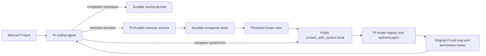

# Native integration review

This review distinguishes implementation conformance from empirical performance. A passing
engineering test suite does not establish state-of-the-art recall, lower bills, or community
endorsement. Victor Taelin owns the OptChat design credit; Mario Zechner, Earendil Works and
the Pi contributors own the runtime credit. See [CREDITS.md](../../CREDITS.md).

Reviewed upstream: [OptChat revision f51fe5c](https://gist.github.com/VictorTaelin/91837951a5ce5b38f341ec1ba1df6449/f51fe5c910427fd6f384d22823140b1693c76207)
and [Pi 1.1.0](https://github.com/earendil-works/pi/releases/tag/v1.1.0).

## What was missing in 0.3

The durable engine existed, but `pi install` opened a separate `/optchat` conversation.
Ordinary user prompts, coding tools and responses were not its memory. The native installer
did not close that architectural gap.

| Gap                                                 | Implementation required                                                                         | Where it belongs                                      |
| --------------------------------------------------- | ----------------------------------------------------------------------------------------------- | ----------------------------------------------------- |
| Ordinary prompts bypassed memory                    | Automatically project history into a frozen view before each main request                       | `src/pi/native.ts`, `projection.ts`                   |
| Coding tools were absent from the archive           | Capture completed host messages and retain original tool calls/results with provenance          | `src/pi/sources.ts`, `archive.ts`                     |
| No session/branch semantics                         | Use the selected ancestry, fork at immutable source entries, reuse only common-prefix summaries | `src/pi/archive.ts`                                   |
| No durable main-context receipt                     | Persist the exact view keyed by the Pi turn boundary before returning it to the provider path   | `FrozenViews` in `archive.ts`                         |
| Failure could fall through hooks                    | Explicitly abort and replace the failed projection; block tools after an archive failure        | `src/pi/native.ts`                                    |
| Native compaction could compete with OptChat        | Cancel host compaction while native mode is active; retain the complete live tool loop          | `src/pi/native.ts`                                    |
| Escape could leave preparation running              | Connect Pi's signal to the durable wait and abort its summary task                              | `native.ts`, `archive.ts`, `controller.ts`            |
| Installation tests covered only auxiliary retrieval | Exercise ordinary prompts and host tools through the distributed Pi CLI                         | `scripts/verify-pi-package.mjs`                       |
| Claims were broader than evidence                   | Publish this matrix, reproducible tests and explicit remaining qualification limits             | this file, [validation](../development/validation.md) |

## Ownership and lifecycle

- **Pi coding-agent** owns the persona, system sections, tool declarations, streaming,
  permissions, steering, model selection and execution of external actions.
- **Pi Durable** owns source copies without reasoning, source references, summaries,
  partitions, frozen-view receipts, checkpoints and summary-task recovery.
- A native turn starts at a custom, context-free Pi entry. The first request awaits a
  complete memory view of the earlier ancestry. Later steps reuse that exact view and
  preserve current-turn messages, tool IDs and reasoning signatures.
- Source append and indexing commit atomically. Completed host messages are also journaled
  before Pi's `message_end` handler returns, including before Pi flushes a new session file.
- Each Pi session has a separate memory directory, so independent terminals do not contend
  for the same writer. `/tree` branches in a session use native Durable history forks.
  `/fork` creates a new session and imports its selected ancestry. It currently rebuilds
  summaries in that new store; it does not share caches across session directories.
- `/reload`, `/new`, `/resume` and `/fork` close the old engine before its extension context
  becomes stale. Merely opening a session, inspecting memory or searching does not resume
  model calls. A normal prompt authorizes preparation; completed turns schedule summaries.
- `--no-session` uses `MemoryStorage`, including the journal: there is no additional
  persistent transcript. The separate legacy `/optchat ask` mode remains explicitly durable.

## Conformance and deliberate adaptations

| OptChat principle                              | Implementation / limitation                                                                                                                                     |
| ---------------------------------------------- | --------------------------------------------------------------------------------------------------------------------------------------------------------------- |
| Complete originals remain recoverable          | Native Pi JSONL originals plus durable copies and source IDs; no silent text truncation                                                                         |
| Binary summaries, contextual compactor         | Existing durable tree, sequential leaves, up to eight ready jobs, no tools/persona in compactor                                                                 |
| Fixed bounded view, incremental coarsening     | Persisted partition; rendered UTF-8 markup counts toward the budget; smaller models can require more coarsening on a new turn                                   |
| Fresh context on each user request             | Previous turns use a bounded memory view, including verbatim short records; the new message is complete, after the view                                         |
| Stable current-turn prefix                     | Frozen receipt reused across tools, native steering and automatic retries                                                                                       |
| Wait for summaries instead of partial fallback | Incomplete or failed memory stops the request; Escape cancels preparation                                                                                       |
| Zoom, date and original-text search            | One namespaced host tool with these actions; UTF-8 paging; Pi entry IDs on original retrieval                                                                   |
| Reasoning not used as memory                   | Excluded from archive/compactor; retained by Pi itself and forwarded unchanged inside the live tool loop                                                        |
| Source attribution                             | User text stays `user`; extension/branch context is `note`; tools and shell output are `tool`/`echo`                                                            |
| Single endless chat                            | SDK/standalone and legacy channel provide one linear history; native Pi mode deliberately follows session/branch boundaries                                     |
| Cache-friendly layout                          | Effective host system/tools, then view and input in separate blocks; unchanged live suffix. Uses Pi's provider caching                                          |
| Specific cache breakpoints in the gist         | Not reproduced by private payload rewriting. Pi's typed text blocks do not expose the three specified per-block markers; exact cache savings remain unqualified |
| No cache-renewal pings                         | Native `cache_warming_decision` returns `stop` while this mode is active                                                                                        |
| Infinite failure retries                       | Bounded durable failures are retained, surfaced and retryable; no indefinite silent billing                                                                     |
| Persistence and one writer                     | Native JSONL fsync and OS-backed writer exclusion; ephemeral mode is explicitly exempt                                                                          |
| Subagents and remote attachment                | Host extensions can provide them; this package does not implement another worker or remote execution system                                                     |

Context edits are honored when deriving the selected branch. A tombstone is omitted from
future model context and normal retrieval; it does **not** erase immutable archive files.
Changing already-frozen history during a run stops that run rather than silently changing its
meaning. Images are retained in original entries and the current turn; the memory tree indexes
their presence, not their visual semantics. No visual-memory benchmark is claimed.

## Failure and recovery contract

Pi 1.1.0 catches ordinary context-hook exceptions. This adapter therefore handles its own
failures, invokes `ctx.abort()` and returns a stopped projection instead of falling back to
raw history. Provider integrations must honor Pi's abort signal. A deliberately non-cooperative
third-party provider or a later extension that rewrites the request is outside this guarantee.
Tool permission hooks remain in the original host pipeline, with an additional block after an
archive error. Compatibility with arbitrary context-rewriting extensions is not assumed.

Durable recovery covers **memory preparation and stored views**, not the host's external
tool execution. A crash after a filesystem/network action but before its result was recorded
leaves an uncertain action. The package never automatically replays that action. A model API
call interrupted by a crash may be repeated and billed by the provider when summary work is
resumed. Streaming fragments before `message_end` are not committed complete messages.

A crash before Pi saves its first transcript can leave only the durable source journal.
Its `config.json` records the original session ID/path; recovery material must be inspected
explicitly. The package does not synthesize or silently resume a Pi tool transcript from it.

Native `/model` selection remains the host's choice. The compactor and maximum memory budget
are saved when the session archive is first created; changing the compactor of an existing
store or migrating in-flight tasks is not supported. Request-size checks are conservative
for text and use Pi's image estimate; these are guards, not an exact tokenizer guarantee.
Virtual model routers are not qualified: these guards use the selected model's declared
limits, not a separately resolved downstream model. Use a concrete model for this candidate.

## Qualification needed before stronger claims

The [OptChat roadmap](../development/roadmap.md) turns these gaps into ordered implementation
and evaluation milestones. Its companion application has a separate scope and acceptance gates.

Deterministic tests establish state transitions and integration contracts. The following
need separately reported evidence before claiming parity or superiority in end-user outcomes:

1. Real-model recall on decisions, corrections, identifiers, numeric facts and adversarial
   instruction-shaped tool results, compared with ordinary Pi and a faithful OptChat baseline.
2. Long histories and branch-heavy workflows, reporting archive growth, p50/p95 preparation
   latency, compactor cost, main-model input and cache read/write usage independently.
3. Real OAuth refresh, provider errors and rate limits; multimodal histories; provider-specific
   caching over realistic pauses. No mocked result can establish these properties.
4. Independent review by users/maintainers of both ecosystems. No endorsement is implied.

Record model IDs, provider/host versions, prompts, corpus hashes, seeds, budgets, raw usage,
failures and complete distributions. Never label faux-provider cache fields as measured
provider savings. Retain regressions and publish negative results with the successful ones.
